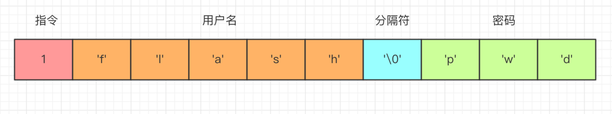
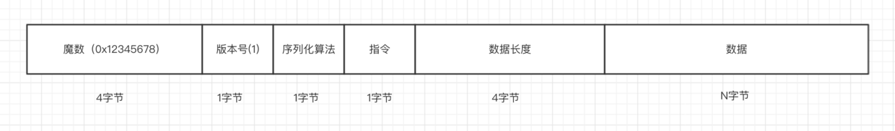

# 客户端与服务端通信协议编解码

## 什么是服务端与客户端的通信协议

> 无论是使用 Netty 还是原始的 Socket 编程，基于 TCP 通信的数据包格式均为二进制，协议指的就是客户端与服务端事先商量好的，每一个二进制数据包中每一段字节分别代表什么含义的规则。如下图的一个简单的登录指令

> 在这个数据包中，第一个字节为 1 表示这是一个登录指令，接下来是用户名和密码，这两个值以 \0 分割，客户端发送这段二进制数据包到服务端，服务端就能根据这个协议来取出用户名密码，进行登录逻辑。实际的通信协议设计中，我们会考虑更多细节，要比这个稍微复杂一些。

- 首先，客户端把一个 Java 对象按照通信协议转换成二进制数据包。
- 然后通过网络，把这段二进制数据包发送到服务端，数据的传输过程由 TCP/IP 协议负责数据的传输，与我们的应用层无关。
- 服务端接受到数据之后，按照协议取出二进制数据包中的相应字段，包装成 Java 对象，交给应用逻辑处理。
- 服务端处理完之后，如果需要吐出响应给客户端，那么按照相同的流程进行

## 通信协议的设计

> 首先，第一个字段是魔数，通常情况下为固定的几个字节（我们这边规定为4个字节）。 为什么需要这个字段，而且还是一个固定的数？假设我们在服务器上开了一个端口，比如 80 端口，如果没有这个魔数，任何数据包传递到服务器，服务器都会根据自定义协议来进行处理，包括不符合自定义协议规范的数据包。例如，我们直接通过 http://服务器ip 来访问服务器（默认为 80 端口）， 服务端收到的是一个标准的 HTTP 协议数据包，但是它仍然会按照事先约定好的协议来处理 HTTP 协议，显然，这是会解析出错的。而有了这个魔数之后，服务端首先取出前面四个字节进行比对，能够在第一时间识别出这个数据包并非是遵循自定义协议的，也就是无效数据包，为了安全考虑可以直接关闭连接以节省资源。在 Java 的字节码的二进制文件中，开头的 4 个字节为0xcafebabe 用来标识这是个字节码文件，亦是异曲同工之妙。

> 接下来一个字节为版本号，通常情况下是预留字段，用于协议升级的时候用到，有点类似 TCP 协议中的一个字段标识是 IPV4 协议还是 IPV6 协议，大多数情况下，这个字段是用不到的，不过为了协议能够支持升级，我们还是先留着。

> 第三部分，序列化算法表示如何把 Java 对象转换二进制数据以及二进制数据如何转换回 Java 对象，比如 Java 自带的序列化，json，hessian 等序列化方式。

> 第四部分的字段表示指令，关于指令相关的介绍，我们在前面已经讨论过，服务端或者客户端每收到一种指令都会有相应的处理逻辑，这里，我们用一个字节来表示，最高支持256种指令，对于我们这个 IM 系统来说已经完全足够了。

> 接下来的字段为数据部分的长度，占四个字节。

> 最后一个部分为数据内容，每一种指令对应的数据是不一样的，比如登录的时候需要用户名密码，收消息的时候需要用户标识和具体消息内容等等。
